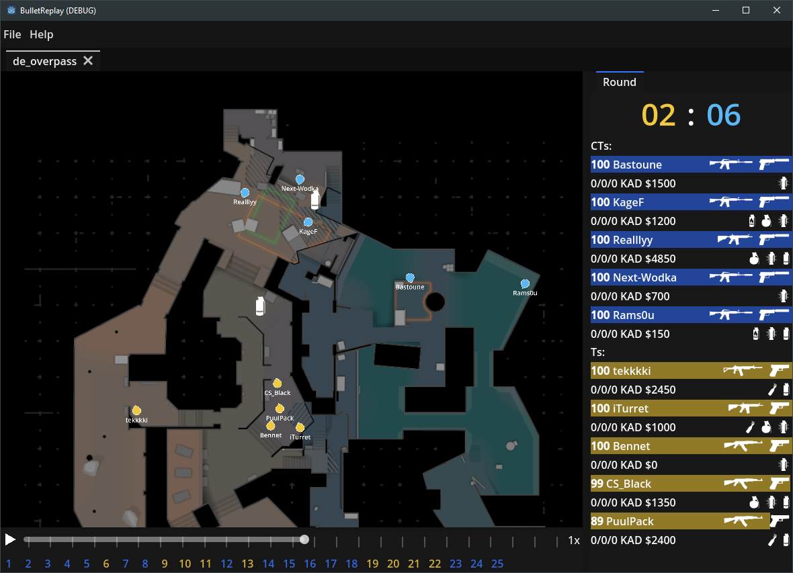

# Bullet Replay

A quick and simple demo replay tool for Counter-Strike 2.
Note: This is a very early Alpha. Expect crashes & bugs.

## Features

| Feature                                           | Availability      |
|---------------------------------------------------|-------------------|
| Track player movement, health, inventory, etc.    | ✅                 |
| Skip between rounds                               | ✅                 |
| Open and review multiple demos at the same time   | ✅                 |
| Web Support                                       | ➖ Planned         |
| On-Screen Drawing                                 | 🟨 Partial support |
| Full Grenade support                              | ➖ Planned         |

## Disclaimer

This project is not affiliated with or endorsed by Valve Corporation.

## Controls

| Function         | Keybind                                              |
|------------------|------------------------------------------------------|
| Move Camera      | Press Mouse-Wheel Button and Move your Mouse         |
| Zoom In/Out      | Scroll with Mouse-Wheel                              |
| Draw             | Hold Left Mouse Button                               |
| Undo Last-Stroke | CTRL + Z                                             |

## Acknowledgement

Developing this tool would not have been possible without the great work of many people. Notably:
- [DemoFile.Net](https://github.com/saul/demofile-net)
- [Godot Engine](https://godotengine.org/)

